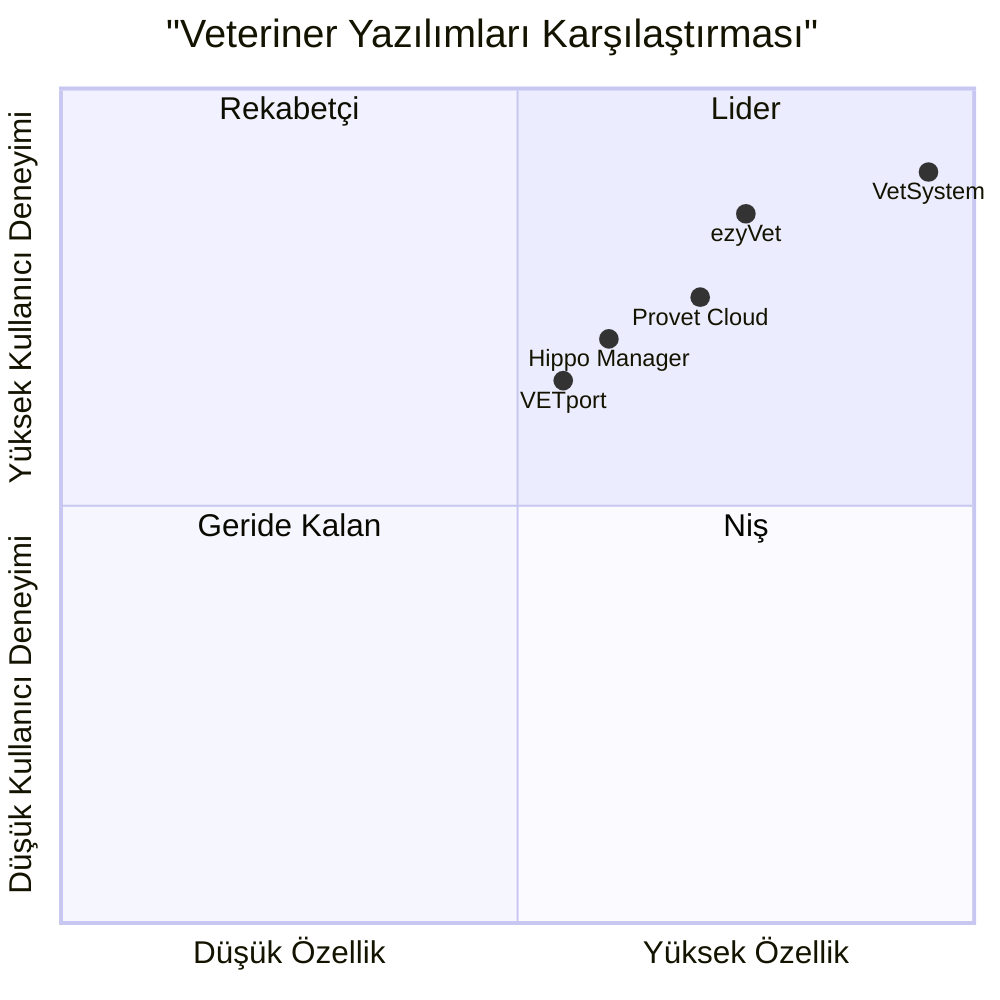

# Veteriner Yönetim Sistemi PRD (Product Requirements Document)

## 1. Proje Bilgileri

### 1.1 Genel Bakış
Bu belge, yapay zeka destekli, kapsamlı bir veteriner yönetim sisteminin gereksinimlerini detaylandırmaktadır. Sistem, pet sahipleri ve veteriner klinikleri için modern, kullanıcı dostu ve AI-destekli bir platform sunmayı hedeflemektedir.

### 1.2 Teknik Stack
- Frontend: React.js, Tailwind CSS
- Backend: Node.js, Express.js
- Database: PostgreSQL
- AI/ML: TensorFlow.js (görüntü işleme)
- Maps Integration: Google Maps API
- Payment Processing: Stripe

### 1.3 Orijinal Gereksinimler
- Kullanıcı ve veteriner üyelik sistemi
- Yapay zeka ile görüntü işleme üzerinden hastalık tespiti
- Kapsamlı hastalık veritabanı
- En yakın kliniklerin gösterimi
- Online mağaza
- Detaylı yönetim paneli


## 2. Ürün Tanımı

### 2.1 Ürün Hedefleri
1. Evcil hayvan sahiplerinin hayvan sağlığını yapay zeka destekli görüntü işleme ve semptom analizi ile proaktif olarak yönetmesini sağlamak
2. Veteriner klinikleri ve pet sahipleri arasında kesintisiz iletişim ve hizmet entegrasyonu sağlamak
3. Kapsamlı bir yönetim platformu sunarak veteriner kliniklerinin operasyonel verimliliğini artırmak

### 2.2 Kullanıcı Hikayeleri

1. Pet Sahibi Perspektifi:
   - Evcil hayvan sahibi olarak, hayvanımın fotoğrafını yükleyerek olası hastalıkları tespit etmek istiyorum
   - Evcil hayvan sahibi olarak, acil durumlarda en yakın veteriner kliniklerini harita üzerinde görmek istiyorum
   - Evcil hayvan sahibi olarak, tüm sağlık kayıtlarını dijital ortamda yönetmek ve randevularımı online planlamak istiyorum
   - Evcil hayvan sahibi olarak, ihtiyaç duyduğum ürünleri online mağazadan sipariş etmek istiyorum

2. Veteriner Perspektifi:
   - Veteriner olarak, hasta kayıtlarını ve tedavi planlarını kolayca yönetmek istiyorum
   - Veteriner olarak, yapay zeka destekli teşhis önerilerinden faydalanmak istiyorum
   - Veteriner olarak, hasta sahipleriyle güvenli bir şekilde iletişim kurmak ve dosya paylaşmak istiyorum

### 2.3 Rekabet Analizi

| Özellik | VetSystem | ezyVet | Hippo Manager | Provet Cloud | VETport |
|---------|-----------|--------|---------------|--------------|----------|
| AI Görüntü İşleme | ✅ | ❌ | ❌ | ❌ | ❌ |
| Hasta Takibi | ✅ | ✅ | ✅ | ✅ | ✅ |
| Online Mağaza | ✅ | ❌ | ❌ | ✅ | ❌ |
| Klinik Harita | ✅ | ❌ | ❌ | ✅ | ✅ |
| Mobil Uygulama | ✅ | ✅ | ✅ | ✅ | ✅ |
| Çoklu Dil | ✅ | ✅ | ❌ | ✅ | ❌ |
| AI Teşhis | ✅ | ❌ | ❌ | ❌ | ❌ |

### 2.4 Rekabet Karesel Grafiği



## 3. Teknik Özellikler

### 3.1 Gereksinim Analizi

#### Kullanıcı Yönetimi ve Kimlik Doğrulama
- Çoklu rol sistemi (Pet Sahibi, Veteriner, Admin)
- E-posta/telefon doğrulama
- Şifre sıfırlama ve güvenlik
- Sosyal medya ile giriş seçenekleri

#### Yapay Zeka ve Görüntü İşleme
- Derin öğrenme modelleri ile hastalık tespiti
- Görüntü ön işleme ve kalite kontrolü
- Çoklu hayvan türü desteği
- Gerçek zamanlı analiz

#### Konum ve Harita Servisleri
- GPS tabanlı klinik arama
- Mesafe ve rota hesaplama
- Gerçek zamanlı müsaitlik durumu
- Acil durum önceliklendirme

#### E-Ticaret ve Ödeme
- Güvenli ödeme işlemleri
- Çoklu ödeme yöntemi
- Stok yönetimi
- Otomatik fiyatlandırma

### 3.2 Gereksinim Havuzu

#### P0 (Kritik Özellikler)
- Kullanıcı kaydı ve kimlik doğrulama
- AI görüntü analizi ve hastalık tespiti
- Hasta kayıt yönetimi
- Randevu planlama sistemi
- Acil durum klinik bulucu
- Temel admin paneli

#### P1 (Önemli Özellikler)
- Online mağaza ve ödeme sistemi
- Çoklu dil desteği
- Veteriner-hasta mesajlaşma
- Otomatik hatırlatmalar
- Detaylı raporlama

#### P2 (İsteğe Bağlı Özellikler)
- Video konsültasyon
- Laboratuvar entegrasyonu
- Gelişmiş analytics
- Mobil uygulama
- Sadakat programı

### 3.3 UI Tasarım Taslağı

#### Ana Sayfa
```
+------------------+
|    Header/Nav    |
+------------------+
| Hero Section     |
| - AI Analiz      |
| - Klinik Bulucu  |
+------------------+
| Özellikler       |
| [ ] [ ] [ ] [ ]  |
+------------------+
| Mağaza Vitrini   |
| [ ] [ ] [ ]      |
+------------------+
|    Footer        |
+------------------+
```

#### Dashboard
```
+--------+----------+
| Nav    | Profil   |
+--------+          |
| Menü   | Veriler  |
|        |          |
| - Pet  | Grafikler|
| - Sağ. |          |
| - Ran. | Detaylar |
| - Mag. |          |
+--------+----------+
```

### 3.4 Açık Sorular

1. Teknik
- AI modelinin eğitim verisi nasıl sağlanacak?
- Görüntü işleme için minimum sistem gereksinimleri neler olmalı?
- Veritabanı şifreleme stratejisi ne olacak?

2. İş
- Veteriner onaylama süreci nasıl yönetilecek?
- Ödeme komisyon oranları ne olacak?
- SLA (Hizmet Seviyesi Anlaşması) metrikleri neler olacak?

3. Yasal
- KVKK uyumluluğu nasıl sağlanacak?
- Veteriner ve kullanıcı sözleşmeleri nasıl yönetilecek?
- Veri saklama politikaları ne olacak?